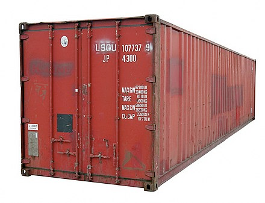
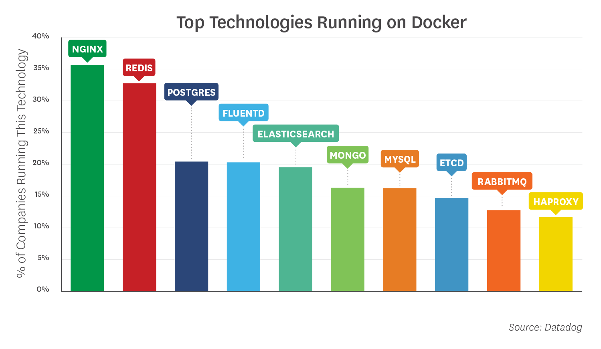

import { Head } from 'mdx-deck'
import { FullScreenCode, Split } from 'mdx-deck/layouts'
import { CodeSurfer } from "mdx-deck-code-surfer"
import vsDark from "prism-react-renderer/themes/vsDark"

import Slab from './components/Slab'
import Layouts from './components/Layouts'
import Todo from './components/Todo'
import Video from './components/Video'
import Tweet from './components/Tweet'

export { default as theme } from './theme'

<Head>
  <title>Frontend Application Bundlessssszzzz: Deployed to CF Pages!!!? pls pls pls</title>
</Head>

## Frontend Application Bundles
### _BerlinJS May 2019_

_@glenmaddern_

```notes

```

---

# 👋
## @glenmaddern!

```notes
Only got 10 minutes.

Thank the organisers anyway.
```

---

export default Layouts.Gradient


```notes
I’m working on a product called Linc

I'm here all weekend and some of next week
```

---

export default Layouts.Light


#### <br/>The Docker of Frontend

```notes
I'm not an expert

But it doesn't matter, FABs & Docker are similar in terms of intent, in terms of what they _enable_

If you don't know Docker too much don't worry either

I’ve also only got 10 minutes, focusing on WHY, talk to me later
```

---

export default Layouts.Light


<figcaption>https://en.wikipedia.org/wiki/Malcom_McLean</figcaption>

```notes
If someone tries to explain Docker, they usually start with the story of Containerization.
```

---

export default Layouts.Light



```notes
Basically, the story goes that the most important invention of the 20th century was a box. This box.

Before the box, stuff shipped one-by-one

After, ship 40 feet of cargo at once.

"Revolutionary", the story goes
```

---

export default Layouts.Light


```notes
Same story for Docker, logo is a shipping container on a... whale for some reason.
```

---

export default Layouts.Light



```notes
Now you don't care what software is running, all your infrastructure can just start caring about these containers, and it's a "revoltionary idea"
```
<figcaption>https://www.datadoghq.com/docker-adoption/</figcaption>

---

export default Layouts.Image(
  require('file-loader!./assets/dwight.jpg')
)

## FALSE

---

export default Layouts.Image(
  require('file-loader!./assets/dwight.jpg')
)

## PARTIALLY FALSE

---

### There were _shipping containers_<br/>before the _Intermodal Container_

```notes
Good boxes, too! 
```

---

### There were _software containers_<br/>before _Docker_

```notes
We just called them Virtual Machines. And lots of companies like Heroku or AWS or VMWare were doing really clever things with their platforms, lots of the same things you can do these days, but Docker was different.
```

---

## Why were _these_ successful?

```notes
They were really successful, they changed their respective worlds.

I don't have time to go into it
```

---

## Why were _these_ successful?

### • Fit-for-purpose
### • Open-source
### • Platform-agnostic
### • Timely

```notes
Talk about how both intermodal containers and docker match these.

ICs were well-designed, but the crucial aspect was that the patents were given away to industry, effectively making them open source, so anyone can use them. They were designed to work with anyone's trucks, anyone's ships, and they came just at the right time as the world was changing after world war 2.

Docker was much more restrictive, the images were dozens or hundreds of megabytes instead of multiple gigs, but the big thing was that it ran everywhere, you weren't locked into any particular hosting platform to make use of this new architecture.
```

---

## What _FABs_ aim to do:

### • Fit-for-purpose
### • Open-source
### • Platform-agnostic
### • Timely

```notes
I'm going to come back to platform-agnostic at the end but I've been here talking X minutes so I think it's probably time to talk about FABs themselves, hey?

I don't have time to go into much detail, obviously the open-source bit is somewhat of a given, I'll just focus on the first one for the moment.
```

---

export default Layouts.Image(
  require('file-loader!./assets/keynote/keynote.001.png')
)

---

export default Layouts.Image(
  require('file-loader!./assets/keynote/keynote.002.png')
)

---

export default Layouts.Image(
  require('file-loader!./assets/keynote/keynote.001.png')
)

---

# Demo

https://github.com/fab-spec/fab-nextjs-example


---

export default Layouts.Light


#

https://fab.dev

<br/>

https://github.com/fab-spec/fab

---

export default Layouts.Code

# NPM Packages

### Compilers:
_@fab/static_ - compile a FAB from a static dir<br/>
_@fab/cra_ - zero-config version of @fab/static for CRA<br/>
_@fab/nextjs_ - compile a NextJS v8 project<br/>
_@fab/afterjs_ - compile a AfterJS project<br/>
_@fab/compile_ - used internally by the above<br/>

### Runtimes:
_@fab/serve_ - run a FAB in a NodeJS express server<br/>
_@fab/cf-workers_ - deploy FAB to a Cloudflare Worker<br/>
_@fab/lambda-edge_ - deploy FAB to Lambda@Edge<br/>
_@fab/now-sh_ - deploy FAB to Now.sh<br/>
_@fab/heroku_ – deploy FAB to Heroku<br/>


---

## The future _isn't static_

---

### Before standardisation<br/>_vs_<br/>After standardisation

---

## _Platform-centric_ innovation

---

## _Problem-centric_ innovation

---


export default Layouts.Gradient


```notes

```

---

## _Linc roadmap_

* Build on each push to Github&nbsp;✅
* Preview links per commit &nbsp;✅
* Instant releases on PR merge &nbsp;✅
* Release to any FAB environment&nbsp;✅
* Blue/green deployments
* Canary deployments
* A/B testing between FABs
* Performance testing each commit
* Visual regression testing
* Parallel acceptance testing
* Smoke testing against production backends

---

# Thankyou!

### https://fab.dev

### https://github.com/fab-spec/fab

### @glenmaddern
