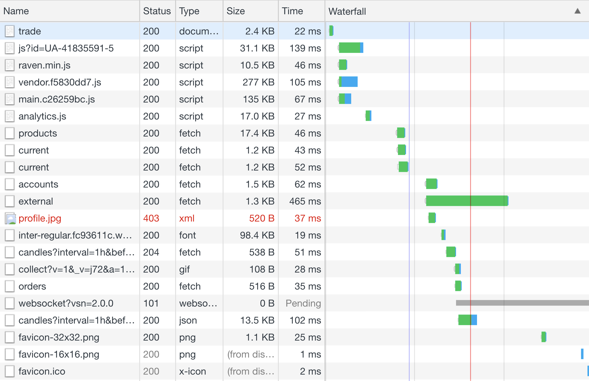
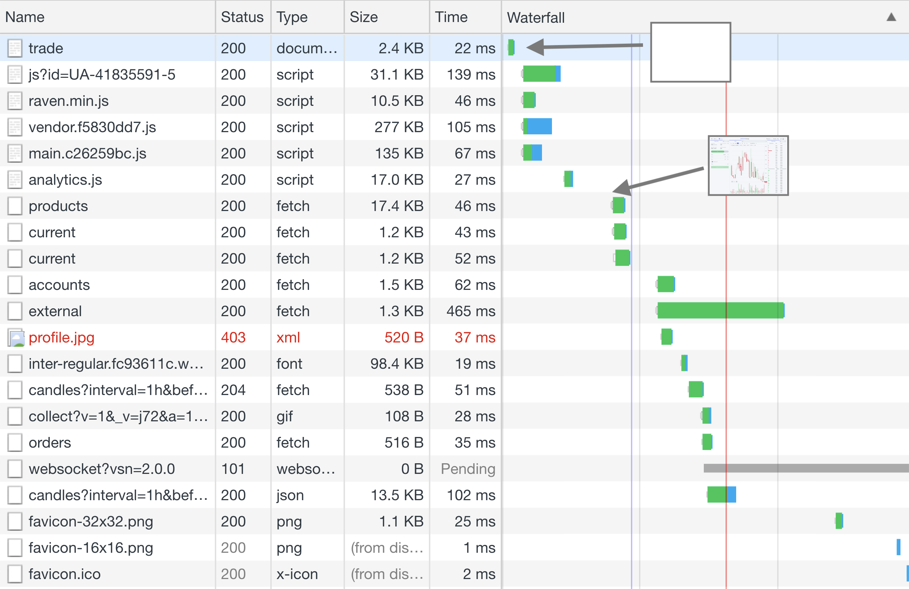
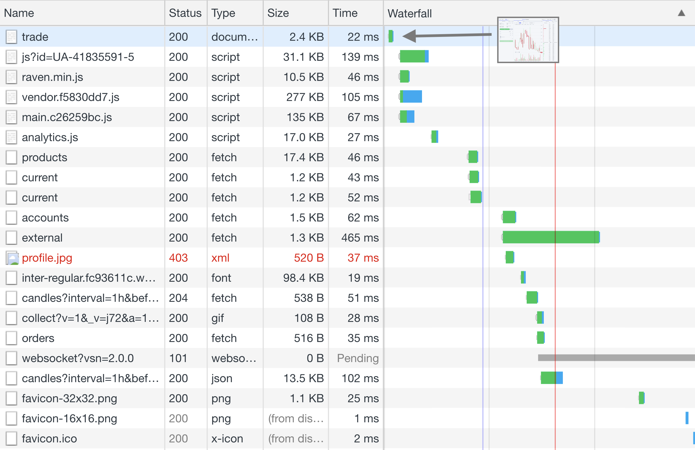
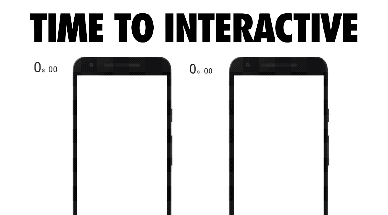
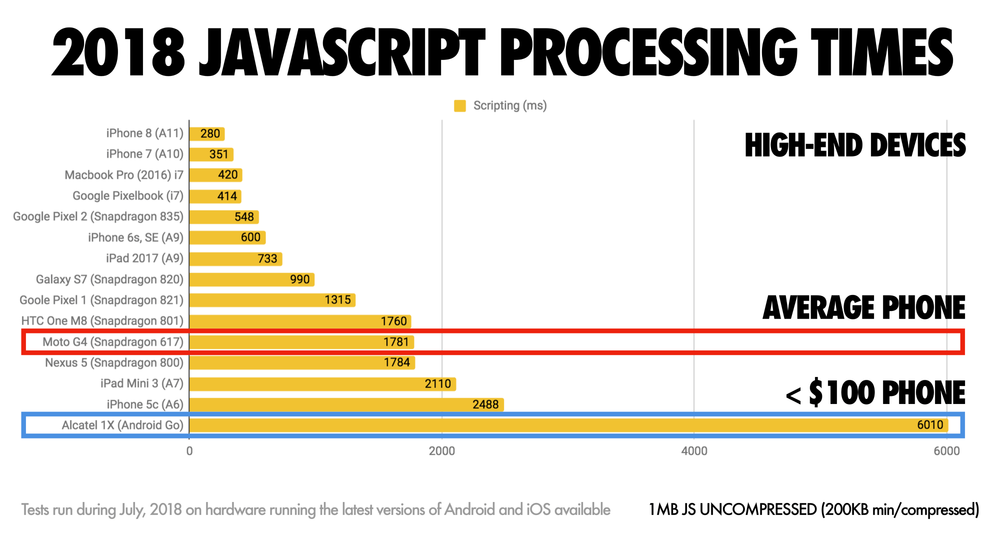
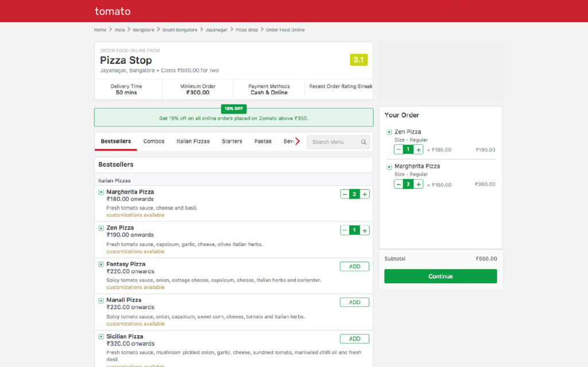
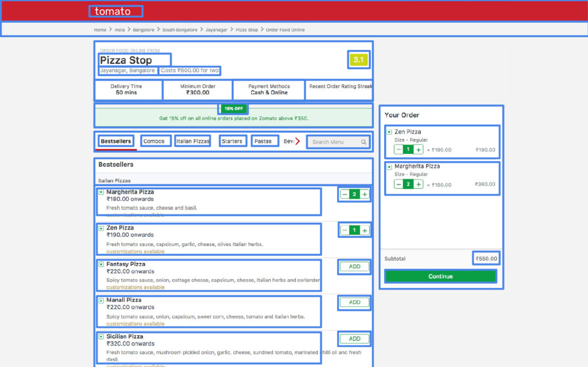
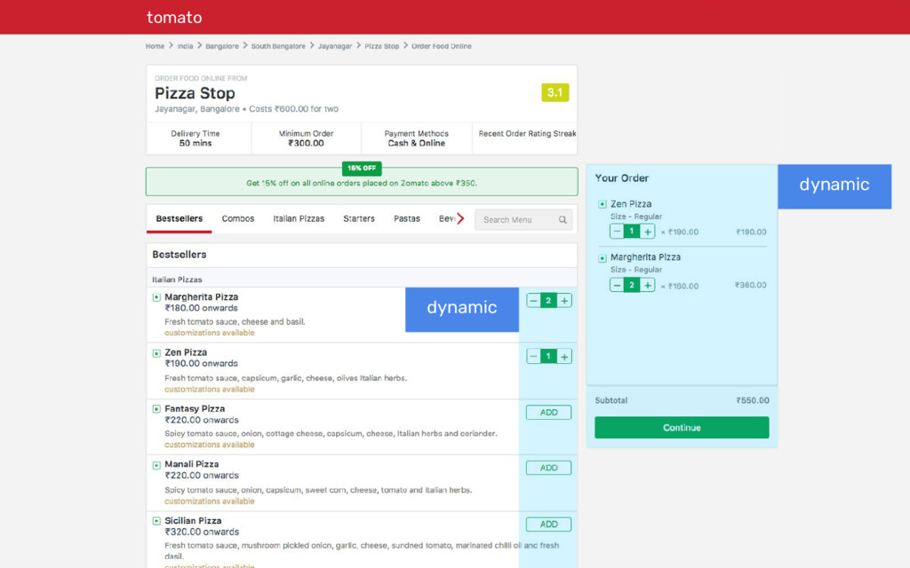
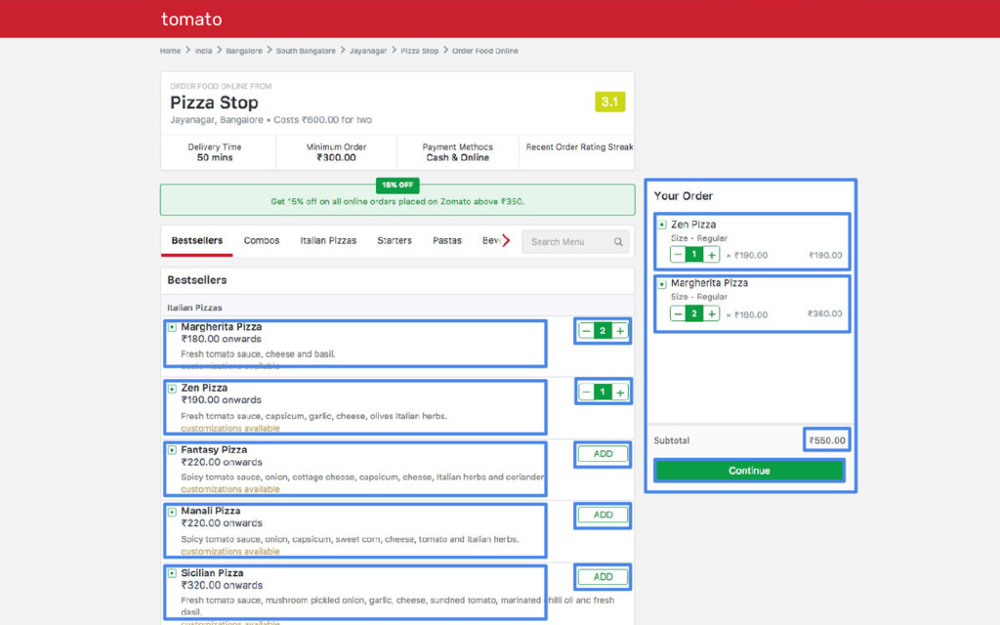

import { Head } from 'mdx-deck'
import { Split } from 'mdx-deck/layouts'

import Slab from './components/Slab'
import Layouts from './components/Layouts'
import Todo from './components/Todo'
import Video from './components/Video'
import Tweet from './components/Tweet'

export { default as theme } from './theme'

<Head>
  <title>Why Frontend Apps Need a Standard Runtime</title>
</Head>

<Slab lines={`
  1 1 70 100 WHY FRONTEND APPS NEED A
  3.2 0.9 50 700 STANDARD
  3.2 0.6 60 700 RUNTIME
`}/>

---

# Disclaimer

---

This is my first talk for over a year


```notes
I super over-prepare talks usually so this is new for me
```

---

# Disclaimer 2

---

I work from home, I don't see humans very often

---

export default Layouts.Images([
  require('file-loader!./assets/prince.jpg'),
  require('file-loader!./assets/whitney.jpg'),
])

<Slab lines={`
  2 1 50 700 MY WORKMATES
`}/>

---

# Disclaimer 3

---

I'm not impartial

---

export default Layouts.Gradient


---

<Slab lines={`
  1 1 70 100 WHY FRONTEND APPS NEED A
  3.2 0.9 50 700 STANDARD
  3.2 0.6 60 700 RUNTIME
`}/>

---

<Slab lines={`
  3 0.8 100 700 BUT
  4 0.8 50 700 GLEN
`}/>

---


---

export default Layouts.Light



---

## RUNTIME

Includes delivery

```notes
This is somewhat unique to web apps.
It's not always that important, but it usually is.
There are other platforms where delivery is important, but not in the same way.
```

---

<Slab lines={`
  1 1 70 100 WHY FRONTEND APPS NEED A
  3.2 0.9 50 700 STANDARD
  3.2 0.6 60 700 RUNTIME
`}/>

```notes
Ok so now we're finally ready to start this talk 
```

---

### Part One
# Beyond Static Rendering

---

export default Layouts.Light


```notes
Now, look at this graph. I'm not prepared enough to actually run this section as a demo so I'm going to point at this thing and try to get you to imagine what's going on.

Let's think about what this graph means. We can see we have an initial period of waiting, then the HTML content is on the screen, then we go off and load the JS, and then we render it locally.

In development, that works great. We have a powerful computer and an instantaneous network. We also have live-reload, so we don't have to spend much time here.

But in production, this process is one of the most important things to optimise.
```

---

export default Layouts.Light



```notes
By default, using something like React that wants to be 100% client-rendered, you usually send down a blank HTML page. Then the JS boots and the app works.

Who here deploys an app like this? Most of the time you're writing a product that requires sign-in, where people will be spending all day there, that sort of thing.

There's nothing wrong with this approach, but it doesn't suit all use cases.
```

---

export default Layouts.Image(
  require('file-loader!./assets/react foo talk/react foo talk.001.png')
)

---

export default Layouts.Image(
  require('file-loader!./assets/react foo talk/react foo talk.002.png')
)

---

export default Layouts.Image(
  require('file-loader!./assets/react foo talk/react foo talk.003.png')
)

---

# NO DOWNSIDE

---

export default Layouts.Image(
  require('file-loader!./assets/galaxy-brain-1.png')
, false)

# Serve inital HTML

---

## Gatsby, NextJS, etc.

---

export default Layouts.Light



---

export default Layouts.Light



<figcaption>
  https://medium.com/@addyosmani/the-cost-of-javascript-in-2018-7d8950fbb5d4
</figcaption>

---

export default Layouts.Light



<figcaption>
  https://medium.com/@addyosmani/the-cost-of-javascript-in-2018-7d8950fbb5d4
</figcaption>

---

export default Layouts.Image(
  require('file-loader!./assets/galaxy-brain-2.png')
, false)

# Bundle Splitting

---

# Current best practice

---

# But we can do better

---

export default Layouts.Light



<figcaption>
  https://speakerdeck.com/siddharthkp/a-portal-to-the-future
</figcaption>

---

export default Layouts.Light



<figcaption>
  https://speakerdeck.com/siddharthkp/a-portal-to-the-future
</figcaption>

---

export default Layouts.Light



<figcaption>
  https://speakerdeck.com/siddharthkp/a-portal-to-the-future
</figcaption>

---

export default Layouts.Light



<figcaption>
  https://speakerdeck.com/siddharthkp/a-portal-to-the-future
</figcaption>

---

export default Layouts.Image(
  require('file-loader!./assets/galaxy-brain-3.png')
, false)

## Don't Rerender<br/>Things That Don't Change

---

## The Future of React

---

<Video videoId="eF7Ca06u58w"/>

---

export default Layouts.Light

<Tweet id="1057420260242931713" options={{conversation: 'none' }}/>

---

export default Layouts.Image(
  require('file-loader!./assets/galaxy-brain-4.png')
, false)

---

export default Layouts.Image(
  require('file-loader!./assets/galaxy-brain-4.png')
, false)

## Whatever the hell that just was

---

## React's Future is Server-Side

---

### Part Two
# Hosting Dynamic Frontend Apps

---

# Hosting Static Apps

* Simple
* Portable
* Can't really fail<br/>(You can still ship broken code tho)
* Scalable
* Efficient

```notes
We can get all these for dynamic too
```

---

# Host your own?

* Simple 🤷‍♂️
* Portable 🤗
* Can't really fail ❌
* Scalable 😬
* Efficient 😬

---

# "Serverless"

* Simple 🤷‍♂️
* Portable 🤗
* Can't really fail 🤗
* Scalable 🤗
* Efficient ❌

---

```notes
- Static is super easy
- Cache + invalidate
- Static + Serverless is the "cool thing" (fire it's the hot thing)
- Lambdas no bueno for frontend apps critical path. Good for APIs
```

---

# We want the benefits of serverless but on a platform fast enough to serve everything

---

### Part Three
# Introducing<br/>Frontend Application Bundles (FABs)

---

### Part Three
# Introducing*<br/>Frontend Application Bundles (FABs)

\* super not ready to use yet, pls don't @ me

---

# Disclaimer 4

There's nothing worse than somebody coming up to talk about something that sounds cool that doesn't exist yet.<br/>Anyway sorry.

---

### File Format

```
my-app.b1c53da6.fab (zip file)
  ├── settings.json
  ├── runtime.js
  └── _assets
        ├── js
        │   ├── main.7fcd9566.js
        │   └── main.7fcd9566.js.map
        └── media
            └── logo_default.e925f90a.svg
```
