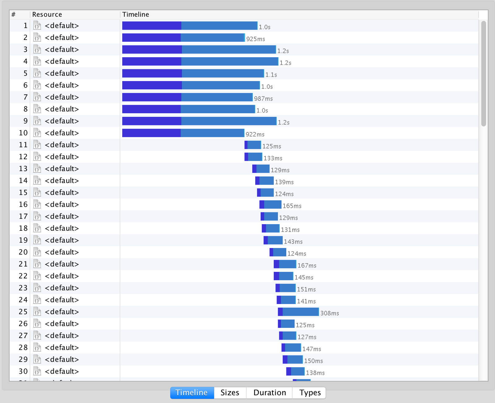

import { Head } from 'mdx-deck'
import { FullScreenCode, Split } from 'mdx-deck/layouts'
import { CodeSurfer } from "mdx-deck-code-surfer"
import vsDark from "prism-react-renderer/themes/vsDark"

import Slab from './components/Slab'
import Layouts from './components/Layouts'
import Todo from './components/Todo'
import Video from './components/Video'
import Tweet from './components/Tweet'

export { default as theme } from './theme'

<Head>
  <title>Frontend Application Bundles: The Docker of Frontend</title>
</Head>

## Frontend Application Bundles
#### MelbJS March 2019

```notes
Notes are working!
```

---

export default Layouts.Light


<Slab lines={`
  0.6 1 120 200 THE DOCKER OF FRONTEND
`}/>

```notes
Hands up if:
- You vaguely know what docker is
- You use it day-to-day
- You really understand it

Now, for those people with their hands still up, you lnow docker a lot better than me. I'm definitely no expert, so if I get some details wrong I apologise, the analogy isn't perfect but I think it works well enough.
```

---

### Part One
# What Docker Changed

---

export default Layouts.Light


<figcaption>https://en.wikipedia.org/wiki/Malcom_McLean</figcaption>

```notes

```

---

export default Layouts.Light


```notes

```

---

## Virtual Machines

---

## Innovation was <br/> _platform-specific_

---

export default Layouts.Light


<figcaption>https://www.docker.com/resources/what-container</figcaption>

```notes

```

---

## Docker was more _restrictive_


---

## Docker was <br/>_open source & platform agnostic_

---

## Docker was _smaller_

Virtual Machine: ~GBs

Docker Image: ~100s MBs

---

## Innovation _exploded_

Blue/green deployments

Autoscaling

Portability

---

### Part Two
# Why Frontend Needs Something New

---

export default Layouts.Light


```notes
Using a sledgehammer to crack a nut
```

---

## Frontend is a <br/>_smaller concern_

---

## What Frontend _needs_

HTTP in/out

Low latency

Scalability

```notes
This isn't what all frontend apps need, but a frontend container standard needs 
```

---

## Static hosting

HTTP in/out ❌

Low latency ✅

Scalability ✅

---

## HTTP in/out

HTTP Headers

Redirects

API proxying

---

export default Layouts.Light


---

export default Layouts.Light


---

## Innovation is <br/> _platform-specific_

---

## Serverless

HTTP in/out ✅

Low latency ❌

Scalability ✅

---


```js
exports.myHandler = async function(event, context) {
   // Called once per request
}
```

---

> *[Lambda]* isn’t running your code in any environment more lightweight than running Node on your own machines.

<figcaption>
  https://blog.cloudflare.com/cloud-computing-without-containers/
</figcaption>

---

> Cold starts happen **once** for<br/>each **concurrent execution** of your function.

<figcaption>
  https://hackernoon.com/im-afraid-you-re-thinking-about-aws-lambda-cold-starts-all-wrong-7d907f278a4f
</figcaption>

---

export default Layouts.Light



<figcaption>
  https://hackernoon.com/im-afraid-you-re-thinking-about-aws-lambda-cold-starts-all-wrong-7d907f278a4f
</figcaption>

---

export default Layouts.Light

##### Lambda performance (200 requests, 50 at a time)


<figcaption>
  https://gist.github.com/geelen/ec56ca115b8fafa45d8a70069bb930fd
</figcaption>

---

export default Layouts.Light

##### Lambda performance (200 requests, 50 at a time)


<figcaption>
  https://gist.github.com/geelen/ec56ca115b8fafa45d8a70069bb930fd
</figcaption>

---

export default Layouts.Light

##### CF Workers performance (200 requests, 50 at a time)


<figcaption>
  https://gist.github.com/geelen/ec56ca115b8fafa45d8a70069bb930fd
</figcaption>

---

### Part Three
# Frontend Application Bundles

---

export default Layouts.Image(
  require('file-loader!./assets/fab-diagram.png')
)

---

##### Frontend Application Bundle

```
fab.zip
  ├── server.js   (server entry point)
  └── _assets     (directory of assets for this release)
```

---

##### server.js

```js
export function getProdSettings() {
  return {
    API_URL: "https://api.example.com",
    CLIENT_ID: "1cd5e6a4871f98616a38abb2eada56868ca5aad2"
  }
}

export async function render(request, settings) {
  return new Response(/* ... */)
}
```

---

```js
export function getProdSettings() { /*...*/ }

export async function render(request, settings) {
  // request: a fetch.Request object
  // settings: production settings plus overrides
  
  const { body, statusCode, headers } = 
             await myApp.render(request, settings)
  
  // return a fetch.Response object with the full data.
  return new Response(body, { statusCode, headers })
}
```

---

##### _assets

```text
_assets            (served under /_assets)
  ├── js
  │   ├── main.7fcd9566.js
  │   └── ...      (fingerprinted, immutable)
  │   ...
  └── _public
      ├── favicon.e925f90a.ico
      └── ...      (auto-fingerprinted, rewrite
                    rule added for /favicon.ico)
  ```

---

##### NPM Packages

```
Compilers:
@fab/static - compile a FAB from a static dir
@fab/nextjs - compile a NextJS v8 project
@fab/afterjs - compile a AfterJS project
@fab/compile - used internally by the above

Runners:
@fab/serve - run a FAB in a NodeJS express server
@fab/cf-workers - deploy FAB to a Cloudflare Worker
@fab/lambda-edge - deploy FAB to Lambda@Edge
```

---

### Part Four
# Demo

---

### Part Five
# Where next?

---

export default Layouts.Light


#

https://fab.dev

https://github.com/fab-spec/fab

---

export default Layouts.Gradient


```notes

```

---

## Development Status

* FAB compilers
  * `@fab/static` released & documented
  * `@fab/nextjs` working, in active development
  * `@fab/afterjs` needs updating


* FAB deployers
  * `@fab/serve` no environments, not production ready
  * `@fab/cf-workers` Linc only, not yet open-sourced
  * `@fab/lambda-edge` Linc only, not yet open-sourced

---

## _Innovation_

---

## _Linc roadmap_

* Preview links per commit &nbsp;✅
* Blue/green deployments
* Canary deployments
* A/B testing between FABs
* Performance testing each commit
* Visual regression testing
* Parallel acceptance testing
* Smoke testing against production backends
