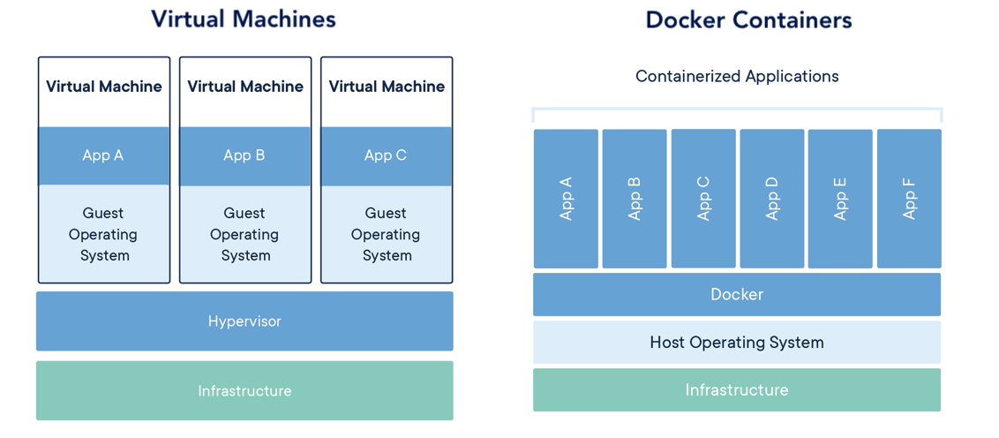
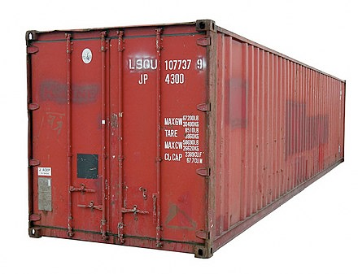

---

## Virtual Machines

---

export default Layouts.Light



<figcaption>https://www.docker.com/resources/what-container</figcaption>

```notes

```

---

## Docker was more _restrictive_

---

## Docker was _smaller_

Virtual Machine: ~GBs

Docker Image: ~100s MBs

---

### Docker was _better,_ but that's not why it's been so successful

---

export default Layouts.Light



```notes

```

---

> After helping McLean create the successful design, _Tantlinger convinced him to give away the patents,_ creating an international standard.

<figcaption>
  https://en.wikipedia.org/wiki/Containerization
</figcaption>

---

## Docker was <br/>_open source_ &<br/>_platform agnostic_


---

### Before standardisation<br/>_vs_<br/>After standardisation

---

## _Platform-centric_ innovation

---

## _Problem-centric_ innovation

---

## What about FABs?

---

## Development Status

* FAB compilers
  * `@fab/static` released & documented
  * `@fab/nextjs` working, in active development
  * `@fab/afterjs` needs updating


* FAB deployers
  * `@fab/serve` no environments, not production ready
  * `@fab/cf-workers` Linc only, not yet open-sourced
  * `@fab/lambda-edge` Linc only, not yet open-sourced

---


---

## Deploying a frontend app in 2019:
### • Use an existing container format
### • Go static only

---

export default Layouts.Light


```notes

```

---

## Frontend is a <br/>_smaller concern_

---

## Static hosting

---

## "Static" hosting

* Static assets
* HTTP Headers
* Redirects
* API proxying

---

export default Layouts.Light


---

export default Layouts.Light


---


---

export default Layouts.Image(
  require('file-loader!./assets/keynote/keynote.003.png')
)

---


---

export default Layouts.Image(
  require('file-loader!./assets/keynote/keynote.004.png')
)
